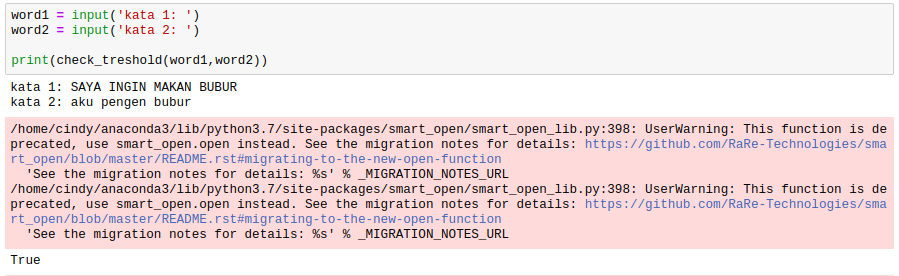
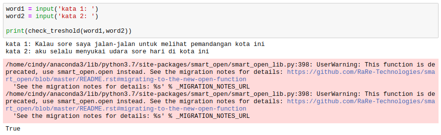
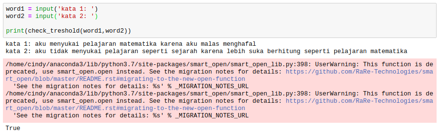
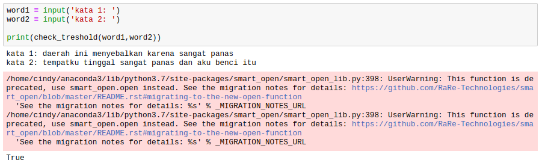
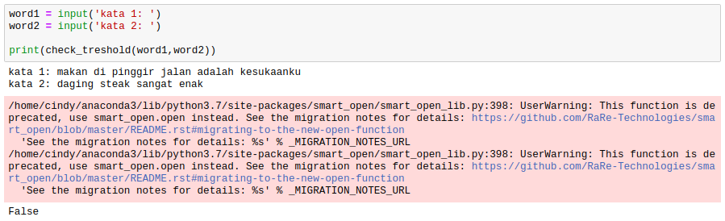

# Checking Sentence Similarity

### Tools that needed to be installed are :
- Gensim versi 3.7.3
- nltk versi 3.4
- pandas versi 0.23.4 

If you already have these library on your python, you can skip this.

### Introduction
In this project, I build sentence detection to check if two sentence have a same meaning. If two sentence have a same meaning, the output of my program will return True vice versa. I give two code python, one is .py if you like to run this program on your terminal, and the other is .ipynb version in case you only want to see this my code, output and documentation.

### How to run 

```
$ python checking_sentence_similarity.py
```

### Installation 
There are something you have to do before running the program. You have to install all library we needed, if you haven't install before.

- First step, you have to install Gensim on your pc   
    ```
    pip install gensim
    ```
- Second step, you have to install nltk on your pc. You can read the documentation on: <br> https://anaconda.org/anaconda/nltk
- The last, if you using anaconda, it must be inslude pandas inside. But if you don't you need to install pandas and you can read the documentation on: <br> https://pandas.pydata.org/pandas-docs/stable/install.html

### Dataset
I use pretrained model word2vec to completed my similarity sentence detection, I only used one dataset it is 'kamus.txt' it is for catching the error if the word is not in word2vec list, so its maybe because it is not a real word like 'renang' became 'berenang' and my program is already solved this issue.

*the original version of word2vec model is on this link 

### Result 
And this is my test result of using my program to detect sentence similarity: <br>





